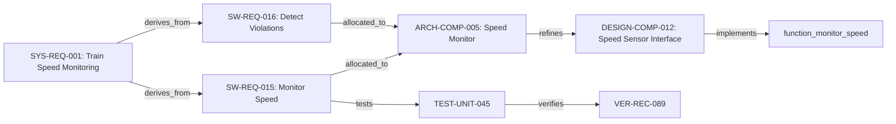
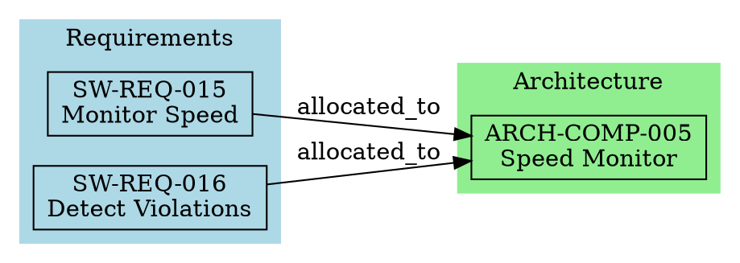

# Traceability Manager Tool - Design Document

**Version**: 1.0  
**Date**: 2026-03-13  
**Status**: Design Phase  
**Author**: OpenCode AI Agent

---

## 1. Executive Summary

The **Traceability Manager** is a Python-based CLI tool for creating, maintaining, and validating traceability matrices across the EN 50128 software development lifecycle. It ensures bidirectional traceability from system requirements through software requirements, architecture, design, implementation, testing, and verification.

**Key Features**:
- Create and maintain traceability matrices (CSV, Markdown, JSON formats)
- Validate traceability completeness (SIL-dependent thresholds)
- Detect gaps (orphan requirements, untested requirements, unimplemented requirements)
- Bidirectional queries (forward: REQ→Design→Code→Test, backward: Test→Code→Design→REQ)
- Generate traceability reports for EN 50128 deliverables
- Import/export traceability data in multiple formats

**EN 50128 Compliance**:
- **SIL 3-4**: 100% traceability MANDATORY (EN 50128 Table A.9, Technique 7)
- **SIL 1-2**: Traceability Highly Recommended
- **SIL 0**: Traceability Recommended

---

## 2. Use Cases

### UC-1: Create Forward Traceability Matrix
**Actor**: Requirements Engineer (REQ), Designer (DES)  
**Goal**: Establish forward traceability from software requirements to architecture components

**Scenario**:
1. User creates Software Requirements Specification with requirements SW-REQ-001 to SW-REQ-050
2. User creates Software Architecture Specification with components ARCH-COMP-001 to ARCH-COMP-010
3. User runs: `traceability.py create --from requirements --to architecture --project TrainControl`
4. Tool creates empty traceability matrix template: `evidence/traceability/requirements_to_architecture.csv`
5. User populates matrix with traceability links (manually or via import)
6. User runs: `traceability.py validate --matrix requirements_to_architecture --sil 3`
7. Tool validates 100% coverage and reports any gaps

**Output**:
- CSV file: `evidence/traceability/requirements_to_architecture.csv`
- Markdown report: `evidence/traceability/requirements_to_architecture.md`
- Validation report with coverage metrics

---

### UC-2: Validate Traceability Completeness
**Actor**: Verifier (VER), Quality Assurance (QUA)  
**Goal**: Verify 100% traceability coverage for SIL 3 project

**Scenario**:
1. User completes design phase and needs to verify traceability before proceeding to implementation
2. User runs: `traceability.py validate --phase design --sil 3 --project TrainControl`
3. Tool checks all required traceability matrices for design phase:
   - System Requirements → Software Requirements
   - Software Requirements → Architecture Components
   - Software Requirements → Test Cases
   - Architecture Components → Design Components
4. Tool reports:
   - Coverage: 98% (49/50 software requirements traced)
   - Orphans: 1 requirement (SW-REQ-037 not allocated to any architecture component)
   - Untested: 3 requirements (SW-REQ-012, SW-REQ-023, SW-REQ-041)
5. User fixes gaps and re-validates until 100% coverage achieved

**Output**:
- Traceability validation report
- List of orphan requirements
- List of untested requirements
- Coverage metrics by SIL level

---

### UC-3: Query Bidirectional Traceability
**Actor**: Developer (IMP), Tester (TST), Verifier (VER)  
**Goal**: Find all requirements traced to a specific architecture component (backward traceability)

**Scenario**:
1. Developer is implementing ARCH-COMP-005 (Train Speed Monitor) and needs to know which requirements it must satisfy
2. User runs: `traceability.py query --target ARCH-COMP-005 --direction backward`
3. Tool searches all traceability matrices and returns:
   - SW-REQ-015: Monitor train speed continuously
   - SW-REQ-016: Detect speed limit violations
   - SW-REQ-017: Trigger emergency brake if speed exceeds limit by 10%
   - SYS-REQ-008: Train shall not exceed posted speed limit (parent requirement)
4. Developer uses this information to ensure implementation satisfies all requirements

**Output**:
- List of traceability links (source → target chain)
- Full requirement details (ID, description, SIL level, status)
- Traceability path visualization (text-based tree)

---

### UC-4: Generate Traceability Report for Document
**Actor**: Requirements Engineer (REQ), Designer (DES), Quality Assurance (QUA)  
**Goal**: Embed traceability matrix in Software Requirements Specification document

**Scenario**:
1. User is finalizing Software Requirements Specification and needs to include forward traceability section
2. User runs: `traceability.py report --from requirements --to architecture,design,tests --format markdown --project TrainControl`
3. Tool generates comprehensive traceability report in Markdown format
4. User copies report into "6. Requirements Traceability" section of SRS document
5. Report includes:
   - Forward traceability: Requirements → Architecture
   - Forward traceability: Requirements → Design
   - Forward traceability: Requirements → Test Cases
   - Coverage metrics
   - Verification status

**Output**:
- Markdown-formatted traceability report
- Embedded tables ready for inclusion in EN 50128 documents
- Coverage statistics

---

### UC-5: Import Traceability from Legacy Tools
**Actor**: Configuration Manager (CM), Project Manager (PM)  
**Goal**: Import existing traceability data from spreadsheets or other tools

**Scenario**:
1. Project has existing traceability data in Excel spreadsheet
2. User exports Excel data to CSV format
3. User runs: `traceability.py import --file legacy_traceability.csv --type requirements_to_design --project TrainControl`
4. Tool validates CSV format and imports traceability links
5. Tool converts to standard format and stores in `evidence/traceability/`
6. Tool generates JSON index for fast queries

**Output**:
- Imported traceability matrix in standard CSV format
- JSON index for queries
- Import validation report

---

### UC-6: Detect and Report Traceability Gaps
**Actor**: Verifier (VER), Quality Assurance (QUA)  
**Goal**: Identify all traceability gaps before phase gate approval

**Scenario**:
1. User is preparing for design phase gate check
2. User runs: `traceability.py check-gaps --phase design --sil 3 --project TrainControl`
3. Tool analyzes all traceability matrices and detects:
   - **Orphan Requirements**: Requirements with no source (not traced to system requirements or hazards)
   - **Unallocated Requirements**: Requirements not allocated to any architecture component
   - **Untested Requirements**: Requirements with no test cases
   - **Unverified Requirements**: Requirements with no verification records
   - **Dangling References**: References to non-existent IDs
4. Tool generates gap analysis report with actionable recommendations
5. User assigns gaps to appropriate roles for resolution

**Output**:
- Gap analysis report (Markdown/JSON)
- List of orphan requirements with recommendations
- List of untested requirements
- List of unallocated requirements
- Actionable task list for gap closure

---

### UC-7: Auto-Extract Traceability from Documents
**Actor**: Designer (DES), Implementer (IMP)  
**Goal**: Automatically extract traceability links from design documents that reference requirements

**Scenario**:
1. User writes Software Design Specification with references like: "This component implements SW-REQ-015, SW-REQ-016"
2. User runs: `traceability.py extract --document docs/Software-Design-Specification.md --type design_to_requirements --project TrainControl`
3. Tool parses document and extracts requirement references using regex patterns
4. Tool creates traceability links: DESIGN-COMP-001 → SW-REQ-015, SW-REQ-016
5. Tool merges extracted links with existing traceability matrix
6. Tool reports confidence level and suggests manual review

**Output**:
- Auto-extracted traceability links (CSV)
- Confidence report (high/medium/low confidence links)
- Merge report showing new links added

---

### UC-8: Generate Traceability Visualization
**Actor**: Project Manager (PM), Assessor, Customer  
**Goal**: Visualize traceability chain from system requirements to verification

**Scenario**:
1. User needs to demonstrate end-to-end traceability for safety assessment
2. User runs: `traceability.py visualize --from system-requirements --to verification --format mermaid --project TrainControl`
3. Tool generates Mermaid diagram showing traceability chain:
   - SYS-REQ-001 → SW-REQ-015 → ARCH-COMP-005 → DESIGN-COMP-012 → function_monitor_speed() → TEST-UNIT-045 → VER-REC-089
4. User embeds diagram in assessment report or presentation

**Output**:
- Mermaid diagram (text format for Markdown)
- GraphViz DOT file (for complex visualizations)
- PNG/SVG image (if GraphViz installed)

---

## 3. CLI Interface Design

### 3.1 Command Structure

```bash
traceability.py <command> [options]
```

### 3.2 Commands

#### 3.2.1 `create` - Create Traceability Matrix

```bash
traceability.py create --from <source_type> --to <target_type> [--project <name>] [--output <path>]
```

**Arguments**:
- `--from`: Source artifact type (system-requirements, requirements, architecture, design, code, tests, verification)
- `--to`: Target artifact type (same options as --from)
- `--project`: Project name (reads from LIFECYCLE_STATE.md if not specified)
- `--output`: Output path (default: evidence/traceability/)

**Example**:
```bash
traceability.py create --from requirements --to architecture --project TrainControl
# Creates: evidence/traceability/requirements_to_architecture.csv (template)
```

---

#### 3.2.2 `validate` - Validate Traceability Completeness

```bash
traceability.py validate [--matrix <name>] [--phase <phase>] --sil <level> [--project <name>]
```

**Arguments**:
- `--matrix`: Specific matrix to validate (e.g., requirements_to_architecture)
- `--phase`: Validate all matrices for lifecycle phase (requirements, design, implementation, etc.)
- `--sil`: SIL level (0-4) for validation thresholds
- `--project`: Project name

**Example**:
```bash
traceability.py validate --phase design --sil 3 --project TrainControl
# Validates all design-phase traceability matrices
# Reports coverage: 100% required for SIL 3
```

---

#### 3.2.3 `query` - Query Traceability Links

```bash
traceability.py query [--source <id>] [--target <id>] [--direction forward|backward|both] [--project <name>]
```

**Arguments**:
- `--source`: Source artifact ID (e.g., SW-REQ-015)
- `--target`: Target artifact ID (e.g., ARCH-COMP-005)
- `--direction`: Query direction (forward: REQ→Design, backward: Design→REQ, both: bidirectional)
- `--project`: Project name

**Example**:
```bash
traceability.py query --source SW-REQ-015 --direction forward
# Returns: SW-REQ-015 → ARCH-COMP-005 → DESIGN-COMP-012 → function_monitor_speed() → TEST-UNIT-045
```

---

#### 3.2.4 `report` - Generate Traceability Report

```bash
traceability.py report --from <source> --to <target1,target2,...> --format <format> [--output <path>] [--project <name>]
```

**Arguments**:
- `--from`: Source artifact type
- `--to`: Comma-separated list of target artifact types
- `--format`: Output format (markdown, csv, json, html)
- `--output`: Output file path
- `--project`: Project name

**Example**:
```bash
traceability.py report --from requirements --to architecture,design,tests --format markdown
# Generates comprehensive traceability report for embedding in SRS document
```

---

#### 3.2.5 `import` - Import Traceability Data

```bash
traceability.py import --file <path> --type <matrix_type> [--format <format>] [--project <name>]
```

**Arguments**:
- `--file`: Input file path
- `--type`: Matrix type (requirements_to_architecture, etc.)
- `--format`: Input format (csv, json, excel) - auto-detected if not specified
- `--project`: Project name

**Example**:
```bash
traceability.py import --file legacy_traces.csv --type requirements_to_design --project TrainControl
```

---

#### 3.2.6 `export` - Export Traceability Data

```bash
traceability.py export --matrix <name> --format <format> --output <path> [--project <name>]
```

**Arguments**:
- `--matrix`: Matrix name (or "all" for all matrices)
- `--format`: Output format (csv, json, excel, markdown)
- `--output`: Output file path
- `--project`: Project name

**Example**:
```bash
traceability.py export --matrix all --format json --output traceability_export.json
```

---

#### 3.2.7 `check-gaps` - Detect Traceability Gaps

```bash
traceability.py check-gaps [--phase <phase>] --sil <level> [--project <name>]
```

**Arguments**:
- `--phase`: Lifecycle phase (validates phase-specific matrices)
- `--sil`: SIL level for gap thresholds
- `--project`: Project name

**Example**:
```bash
traceability.py check-gaps --phase design --sil 3 --project TrainControl
# Reports: orphans, untested requirements, unallocated requirements
```

---

#### 3.2.8 `extract` - Auto-Extract Traceability from Documents

```bash
traceability.py extract --document <path> --type <link_type> [--merge] [--project <name>]
```

**Arguments**:
- `--document`: Document file path (Markdown, C source, etc.)
- `--type`: Traceability link type (design_to_requirements, code_to_requirements, etc.)
- `--merge`: Merge extracted links with existing matrix (default: false)
- `--project`: Project name

**Example**:
```bash
traceability.py extract --document docs/Software-Design-Specification.md --type design_to_requirements --merge
```

---

#### 3.2.9 `visualize` - Generate Traceability Visualization

```bash
traceability.py visualize --from <source> --to <target> [--format mermaid|dot|svg] [--output <path>] [--project <name>]
```

**Arguments**:
- `--from`: Source artifact type or specific artifact ID
- `--to`: Target artifact type
- `--format`: Visualization format (mermaid, dot, svg, png)
- `--output`: Output file path
- `--project`: Project name

**Example**:
```bash
traceability.py visualize --from system-requirements --to verification --format mermaid
```

---

#### 3.2.10 `sync` - Synchronize Traceability Formats

```bash
traceability.py sync --matrix <name> [--project <name>]
```

**Arguments**:
- `--matrix`: Matrix name (or "all")
- `--project`: Project name

**Description**: Synchronizes CSV (primary), JSON (query index), and Markdown (document embedding) formats

**Example**:
```bash
traceability.py sync --matrix requirements_to_architecture
# Reads CSV, updates JSON index, regenerates Markdown report
```

---

### 3.3 Global Options

```bash
--verbose, -v       Verbose output (show detailed traceability chains)
--quiet, -q         Quiet mode (only show errors)
--project <name>    Project name (overrides LIFECYCLE_STATE.md)
--config <path>     Configuration file path (default: .traceability.yaml)
--help, -h          Show help message
--version           Show version information
```

---

## 4. Data Models

### 4.1 Traceability Link

**Core Data Structure**:

```python
@dataclass
class TraceabilityLink:
    """Represents a single traceability link between two artifacts."""
    
    # Link identifiers
    source_id: str          # e.g., "SW-REQ-015"
    source_type: str        # e.g., "software_requirement"
    target_id: str          # e.g., "ARCH-COMP-005"
    target_type: str        # e.g., "architecture_component"
    
    # Link metadata
    link_type: str          # e.g., "allocated_to", "implements", "tests", "verifies"
    rationale: str          # Human-readable explanation
    
    # Verification data
    verified: bool          # Has link been verified?
    verified_by: str        # Role/person who verified (e.g., "VER", "John Doe")
    verified_date: str      # ISO 8601 date
    
    # Quality metadata
    confidence: str         # "high", "medium", "low" (for auto-extracted links)
    source_document: str    # Document where link was established
    
    # Traceability
    created_date: str       # ISO 8601 date
    modified_date: str      # ISO 8601 date
    version: str            # Link version (for change tracking)
```

---

### 4.2 Traceability Matrix

**Data Structure**:

```python
@dataclass
class TraceabilityMatrix:
    """Represents a complete traceability matrix between two artifact types."""
    
    # Matrix metadata
    name: str               # e.g., "requirements_to_architecture"
    source_type: str        # e.g., "software_requirement"
    target_type: str        # e.g., "architecture_component"
    project: str            # Project name
    
    # Links
    links: List[TraceabilityLink]
    
    # Validation metadata
    coverage: float         # 0.0 to 1.0 (percentage of sources with at least one target)
    completeness: float     # 0.0 to 1.0 (all validation criteria met)
    sil_level: int          # SIL level (0-4)
    
    # Status
    status: str             # "draft", "review", "approved", "baseline"
    approved_by: str        # Role/person who approved
    approved_date: str      # ISO 8601 date
    
    # File paths
    csv_path: str           # Path to CSV file
    json_path: str          # Path to JSON file
    markdown_path: str      # Path to Markdown report
    
    # Version control
    version: str            # Matrix version
    baseline: str           # Git tag for baseline (if baselined)
```

---

### 4.3 Artifact Types

**Enumeration of Artifact Types**:

```python
class ArtifactType(Enum):
    """EN 50128 artifact types for traceability."""
    
    # Requirements
    SYSTEM_REQUIREMENT = "system_requirement"
    SOFTWARE_REQUIREMENT = "software_requirement"
    SAFETY_REQUIREMENT = "safety_requirement"
    INTERFACE_REQUIREMENT = "interface_requirement"
    
    # Design
    ARCHITECTURE_COMPONENT = "architecture_component"
    DESIGN_COMPONENT = "design_component"
    INTERFACE_SPECIFICATION = "interface_specification"
    
    # Implementation
    SOURCE_FILE = "source_file"
    FUNCTION = "function"
    MODULE = "module"
    
    # Testing
    TEST_CASE = "test_case"
    TEST_PROCEDURE = "test_procedure"
    TEST_RESULT = "test_result"
    
    # Verification
    VERIFICATION_RECORD = "verification_record"
    REVIEW_RECORD = "review_record"
    
    # Safety
    HAZARD = "hazard"
    SAFETY_MECHANISM = "safety_mechanism"
    
    # Other
    DELIVERABLE = "deliverable"
    CHANGE_REQUEST = "change_request"
```

---

### 4.4 Link Types

**Enumeration of Link Types**:

```python
class LinkType(Enum):
    """Types of traceability relationships."""
    
    # Forward traceability (requirements → implementation)
    DERIVES_FROM = "derives_from"          # SW Req derives from System Req
    ALLOCATED_TO = "allocated_to"          # Req allocated to component
    IMPLEMENTS = "implements"              # Code implements requirement
    REFINES = "refines"                    # Design refines architecture
    
    # Testing traceability
    TESTS = "tests"                        # Test case tests requirement
    VERIFIES = "verifies"                  # Verification record verifies requirement
    VALIDATES = "validates"                # Validation test validates requirement
    
    # Safety traceability
    MITIGATES = "mitigates"                # Safety mechanism mitigates hazard
    CAUSES = "causes"                      # Failure mode causes hazard
    
    # Change traceability
    IMPACTS = "impacts"                    # Change impacts artifact
    MODIFIED_BY = "modified_by"            # Artifact modified by change request
    
    # Dependency traceability
    DEPENDS_ON = "depends_on"              # Artifact depends on another
    CONSTRAINS = "constrains"              # Artifact constrains another
```

---

### 4.5 Validation Rules

**Data Structure for SIL-Dependent Validation**:

```python
@dataclass
class ValidationRules:
    """SIL-dependent validation rules for traceability matrices."""
    
    sil_level: int
    
    # Coverage requirements
    min_coverage: float         # Minimum % of sources with targets (1.0 = 100% for SIL 3-4)
    allow_orphans: bool         # Allow requirements without sources? (False for SIL 3-4)
    require_testing: bool       # Require test case for each requirement? (True for SIL 3-4)
    require_verification: bool  # Require verification record? (True for SIL 3-4)
    
    # Link quality
    require_rationale: bool     # Require rationale for each link? (True for SIL 3-4)
    require_verification: bool  # Require link verification? (True for SIL 3-4)
    
    # Matrix status
    require_approval: bool      # Require approval before baseline? (True for SIL 3-4)
    independent_verifier: bool  # Require independent verifier? (True for SIL 3-4)

# SIL-dependent rules
SIL_VALIDATION_RULES = {
    0: ValidationRules(sil_level=0, min_coverage=0.8, allow_orphans=True, 
                       require_testing=False, require_verification=False,
                       require_rationale=False, require_verification=False,
                       require_approval=False, independent_verifier=False),
    
    1: ValidationRules(sil_level=1, min_coverage=0.9, allow_orphans=True,
                       require_testing=True, require_verification=False,
                       require_rationale=False, require_verification=False,
                       require_approval=True, independent_verifier=False),
    
    2: ValidationRules(sil_level=2, min_coverage=0.95, allow_orphans=False,
                       require_testing=True, require_verification=True,
                       require_rationale=True, require_verification=False,
                       require_approval=True, independent_verifier=False),
    
    3: ValidationRules(sil_level=3, min_coverage=1.0, allow_orphans=False,
                       require_testing=True, require_verification=True,
                       require_rationale=True, require_verification=True,
                       require_approval=True, independent_verifier=True),
    
    4: ValidationRules(sil_level=4, min_coverage=1.0, allow_orphans=False,
                       require_testing=True, require_verification=True,
                       require_rationale=True, require_verification=True,
                       require_approval=True, independent_verifier=True),
}
```

---

## 5. Data Storage Formats

### 5.1 Primary Storage: CSV Format

**File**: `evidence/traceability/{source}_to_{target}.csv`

**Format**:
```csv
source_id,source_type,target_id,target_type,link_type,rationale,verified,verified_by,verified_date,confidence,source_document,created_date,modified_date,version
SW-REQ-015,software_requirement,ARCH-COMP-005,architecture_component,allocated_to,Train speed monitoring function,true,VER,2026-03-10,high,Software-Architecture-Specification.md,2026-03-01,2026-03-10,1.0
SW-REQ-016,software_requirement,ARCH-COMP-005,architecture_component,allocated_to,Speed limit violation detection,true,VER,2026-03-10,high,Software-Architecture-Specification.md,2026-03-01,2026-03-10,1.0
```

**Why CSV?**
- Simple, tool-friendly (Excel, LibreOffice, pandas, etc.)
- Easy version control (Git diffs work well)
- Standard format for EN 50128 evidence
- Machine-readable for automation

---

### 5.2 Query Index: JSON Format

**File**: `evidence/traceability/{source}_to_{target}.json`

**Format**:
```json
{
  "metadata": {
    "name": "requirements_to_architecture",
    "source_type": "software_requirement",
    "target_type": "architecture_component",
    "project": "TrainControl",
    "coverage": 1.0,
    "completeness": 1.0,
    "sil_level": 3,
    "status": "approved",
    "approved_by": "VER",
    "approved_date": "2026-03-12",
    "version": "1.0",
    "baseline": "v1.0.0"
  },
  "links": [
    {
      "source_id": "SW-REQ-015",
      "source_type": "software_requirement",
      "target_id": "ARCH-COMP-005",
      "target_type": "architecture_component",
      "link_type": "allocated_to",
      "rationale": "Train speed monitoring function",
      "verified": true,
      "verified_by": "VER",
      "verified_date": "2026-03-10",
      "confidence": "high",
      "source_document": "Software-Architecture-Specification.md",
      "created_date": "2026-03-01",
      "modified_date": "2026-03-10",
      "version": "1.0"
    }
  ],
  "indexes": {
    "by_source": {
      "SW-REQ-015": ["ARCH-COMP-005"],
      "SW-REQ-016": ["ARCH-COMP-005"]
    },
    "by_target": {
      "ARCH-COMP-005": ["SW-REQ-015", "SW-REQ-016"]
    }
  }
}
```

**Why JSON?**
- Structured data with metadata
- Fast queries using indexes
- Easy to parse in Python/JavaScript
- Supports nested structures

---

### 5.3 Document Embedding: Markdown Format

**File**: `evidence/traceability/{source}_to_{target}.md`

**Format**:
```markdown
# Traceability Matrix: Software Requirements → Architecture

**Project**: TrainControl  
**SIL Level**: 3  
**Coverage**: 100% (50/50 requirements allocated)  
**Status**: Approved  
**Approved By**: VER  
**Date**: 2026-03-12  
**Baseline**: v1.0.0

---

## Forward Traceability

| Requirement ID | Requirement Description | Architecture Component | Component Description | Link Type | Verified |
|----------------|-------------------------|------------------------|-----------------------|-----------|----------|
| SW-REQ-015 | Monitor train speed continuously | ARCH-COMP-005 | Train Speed Monitor | allocated_to | ✅ |
| SW-REQ-016 | Detect speed limit violations | ARCH-COMP-005 | Train Speed Monitor | allocated_to | ✅ |
| SW-REQ-017 | Trigger emergency brake if speed exceeds limit | ARCH-COMP-006 | Emergency Brake Controller | allocated_to | ✅ |

---

## Coverage Analysis

- **Total Requirements**: 50
- **Requirements with Allocation**: 50 (100%)
- **Orphan Requirements**: 0
- **Untested Requirements**: 0
- **Unverified Links**: 0

---

## Verification Status

✅ **PASSED** - All traceability requirements met for SIL 3

- Coverage: 100% (required: 100%)
- No orphan requirements (required: 0)
- All requirements tested (required: yes)
- All links verified (required: yes)
- Matrix approved by independent verifier (required: yes)
```

**Why Markdown?**
- Human-readable
- Embeds directly in EN 50128 documents
- Version control friendly
- Can be converted to PDF/HTML for reports

---

### 5.4 Directory Structure

```
project_root/
├── evidence/
│   └── traceability/
│       ├── system_to_software_requirements.csv
│       ├── system_to_software_requirements.json
│       ├── system_to_software_requirements.md
│       ├── requirements_to_architecture.csv
│       ├── requirements_to_architecture.json
│       ├── requirements_to_architecture.md
│       ├── requirements_to_design.csv
│       ├── requirements_to_design.json
│       ├── requirements_to_design.md
│       ├── requirements_to_tests.csv
│       ├── requirements_to_tests.json
│       ├── requirements_to_tests.md
│       ├── tests_to_verification.csv
│       ├── tests_to_verification.json
│       ├── tests_to_verification.md
│       ├── hazards_to_requirements.csv
│       ├── hazards_to_requirements.json
│       ├── hazards_to_requirements.md
│       └── index.json  # Master index of all matrices
```

---

## 6. Integration with Existing Infrastructure

### 6.1 Deliverables Metadata Integration

**Approach**: Use deliverables metadata (`deliverables/*/DOC-*.yaml`) as **source of truth** for document-level traceability.

**Integration Points**:

1. **Document Dependencies** (`depends_on` field):
   - Software Requirements Specification depends on System Requirements Specification
   - Tool reads `depends_on` and creates document-level traceability automatically
   
2. **Forward Feeds** (`feeds_into` field):
   - Software Requirements Specification feeds into Software Architecture Specification
   - Tool uses this to determine which detailed traceability matrices are required

3. **Evidence Requirements** (`evidence_requirements` field):
   - Specifies required traceability evidence (e.g., "requirements_traceability_matrix.csv")
   - Tool validates that required matrices exist and meet SIL requirements

**Example**:
```python
# Read deliverable metadata
srs_metadata = load_deliverable("deliverables/requirements/Software-Requirements-Specification.yaml")

# Extract document dependencies
for dep in srs_metadata['depends_on']:
    # Create document-level traceability link
    # dep = "System-Requirements-Specification"
    create_document_trace(source=dep, target="Software-Requirements-Specification")

# Extract forward feeds
for feed in srs_metadata['feeds_into']:
    # feed = "Software-Architecture-Specification"
    # Tool knows: requirements_to_architecture matrix is required
    register_required_matrix(source="requirements", target="architecture")
```

---

### 6.2 LIFECYCLE_STATE.md Integration

**Approach**: Use `LIFECYCLE_STATE.md` to determine current phase and required traceability matrices.

**Integration Points**:

1. **Current Phase Detection**:
   - Tool reads `LIFECYCLE_STATE.md` to determine current phase
   - Tool loads phase-specific traceability requirements

2. **Phase Gate Validation**:
   - When user runs `traceability.py validate --phase design --sil 3`
   - Tool checks all design-phase traceability matrices are complete

3. **Traceability Status Reporting**:
   - Tool can update traceability status in `LIFECYCLE_STATE.md`
   - Example: "Phase 2 Traceability: 98% complete (49/50 requirements traced)"

**Example**:
```python
# Read lifecycle state
lifecycle = parse_lifecycle_state("LIFECYCLE_STATE.md")
current_phase = lifecycle['current_phase']  # e.g., "Phase 2: Requirements"
sil_level = lifecycle['sil_level']  # e.g., 3

# Determine required matrices for phase
required_matrices = get_required_matrices(phase=current_phase, sil=sil_level)
# Returns: ["system_to_software_requirements", "requirements_to_tests", "hazards_to_requirements"]

# Validate all required matrices
for matrix_name in required_matrices:
    validate_matrix(matrix_name, sil=sil_level)
```

---

### 6.3 Workspace Manager Integration

**Approach**: Extend `tools/workspace.py` with traceability commands (or call traceability tool from workspace manager).

**Integration Options**:

**Option A: Standalone Tool**:
```bash
# User switches project
workspace.py switch TrainControl

# User runs traceability command (auto-detects project from LIFECYCLE_STATE.md)
traceability.py validate --phase design --sil 3
```

**Option B: Integrated Commands**:
```bash
# User switches project and runs traceability
workspace.py switch TrainControl
workspace.py traceability validate --phase design --sil 3
```

**Recommendation**: **Option A** (standalone tool) for initial implementation, with Option B as future enhancement.

---

## 7. Validation and Verification

### 7.1 SIL-Dependent Validation Criteria

| Criterion | SIL 0 | SIL 1 | SIL 2 | SIL 3 | SIL 4 |
|-----------|-------|-------|-------|-------|-------|
| **Minimum Coverage** | 80% | 90% | 95% | 100% | 100% |
| **Allow Orphan Requirements** | Yes | Yes | No | No | No |
| **Require Test Cases** | No | Yes | Yes | Yes | Yes |
| **Require Verification Records** | No | No | Yes | Yes | Yes |
| **Require Link Rationale** | No | No | Yes | Yes | Yes |
| **Require Link Verification** | No | No | No | Yes | Yes |
| **Require Matrix Approval** | No | Yes | Yes | Yes | Yes |
| **Require Independent Verifier** | No | No | No | Yes | Yes |

---

### 7.2 Gap Detection Algorithms

#### 7.2.1 Orphan Requirements
**Definition**: Requirements with no backward traceability (not derived from system requirements or hazards)

**Algorithm**:
```python
def detect_orphan_requirements(requirements: List[str], 
                               system_traces: TraceabilityMatrix,
                               hazard_traces: TraceabilityMatrix) -> List[str]:
    orphans = []
    for req_id in requirements:
        has_system_trace = req_id in system_traces.get_targets()
        has_hazard_trace = req_id in hazard_traces.get_targets()
        if not has_system_trace and not has_hazard_trace:
            orphans.append(req_id)
    return orphans
```

---

#### 7.2.2 Untested Requirements
**Definition**: Requirements with no test case traceability

**Algorithm**:
```python
def detect_untested_requirements(requirements: List[str],
                                test_traces: TraceabilityMatrix) -> List[str]:
    untested = []
    for req_id in requirements:
        test_cases = test_traces.get_targets_for_source(req_id)
        if len(test_cases) == 0:
            untested.append(req_id)
    return untested
```

---

#### 7.2.3 Unallocated Requirements
**Definition**: Requirements not allocated to any architecture or design component

**Algorithm**:
```python
def detect_unallocated_requirements(requirements: List[str],
                                   arch_traces: TraceabilityMatrix,
                                   design_traces: TraceabilityMatrix) -> List[str]:
    unallocated = []
    for req_id in requirements:
        has_arch = req_id in arch_traces.get_sources()
        has_design = req_id in design_traces.get_sources()
        if not has_arch and not has_design:
            unallocated.append(req_id)
    return unallocated
```

---

#### 7.2.4 Dangling References
**Definition**: Traceability links pointing to non-existent artifact IDs

**Algorithm**:
```python
def detect_dangling_references(matrix: TraceabilityMatrix,
                               source_artifacts: List[str],
                               target_artifacts: List[str]) -> List[TraceabilityLink]:
    dangling = []
    for link in matrix.links:
        if link.source_id not in source_artifacts:
            dangling.append(link)  # Source doesn't exist
        if link.target_id not in target_artifacts:
            dangling.append(link)  # Target doesn't exist
    return dangling
```

---

### 7.3 Coverage Metrics

```python
@dataclass
class CoverageMetrics:
    """Traceability coverage metrics."""
    
    # Source coverage
    total_sources: int          # Total number of source artifacts
    sources_with_targets: int   # Number of sources with at least one target
    source_coverage: float      # sources_with_targets / total_sources
    
    # Target coverage
    total_targets: int          # Total number of target artifacts
    targets_with_sources: int   # Number of targets with at least one source
    target_coverage: float      # targets_with_sources / total_targets
    
    # Link quality
    total_links: int            # Total number of traceability links
    verified_links: int         # Number of verified links
    verification_coverage: float # verified_links / total_links
    
    # Gaps
    orphan_sources: int         # Sources without backward traceability
    orphan_targets: int         # Targets without sources
    dangling_references: int    # Links pointing to non-existent IDs
    
    # Validation
    meets_sil_requirements: bool  # Does coverage meet SIL requirements?
    validation_issues: List[str]  # List of validation issues
```

---

## 8. Auto-Extraction from Documents

### 8.1 Requirement ID Patterns

**Regex Patterns for Requirement References**:

```python
REQUIREMENT_PATTERNS = {
    'software_requirement': r'\b(SW-REQ-\d{3,4})\b',
    'system_requirement': r'\b(SYS-REQ-\d{3,4})\b',
    'safety_requirement': r'\b(SAF-REQ-\d{3,4})\b',
    'interface_requirement': r'\b(INT-REQ-\d{3,4})\b',
    'architecture_component': r'\b(ARCH-COMP-\d{3,4})\b',
    'design_component': r'\b(DESIGN-COMP-\d{3,4})\b',
    'test_case': r'\b(TEST-(UNIT|INT|SYS)-\d{3,4})\b',
    'hazard': r'\b(HAZ-\d{3,4})\b',
}
```

---

### 8.2 Context-Based Link Type Detection

**Heuristics for Detecting Link Types**:

```python
LINK_TYPE_KEYWORDS = {
    'implements': ['implements', 'satisfies', 'fulfills', 'meets requirement'],
    'tests': ['tests', 'verifies', 'validates', 'test case for'],
    'refines': ['refines', 'elaborates', 'details', 'decomposes'],
    'derives_from': ['derived from', 'based on', 'traces to'],
    'mitigates': ['mitigates', 'prevents', 'protects against', 'safety mechanism for'],
}

def detect_link_type(context: str) -> str:
    """Detect link type from surrounding text context."""
    context_lower = context.lower()
    for link_type, keywords in LINK_TYPE_KEYWORDS.items():
        if any(keyword in context_lower for keyword in keywords):
            return link_type
    return 'related_to'  # Default fallback
```

---

### 8.3 Confidence Scoring

```python
@dataclass
class ExtractionResult:
    """Result of auto-extraction from document."""
    
    link: TraceabilityLink
    confidence: str             # 'high', 'medium', 'low'
    context: str                # Surrounding text
    line_number: int            # Line in document where found
    suggestions: List[str]      # Suggestions for manual review
    
def calculate_confidence(link: TraceabilityLink, context: str) -> str:
    """Calculate confidence score for extracted link."""
    
    # High confidence: explicit keywords + valid IDs
    if has_explicit_keyword(context) and validate_ids(link):
        return 'high'
    
    # Medium confidence: valid IDs but ambiguous context
    elif validate_ids(link):
        return 'medium'
    
    # Low confidence: IDs found but unclear relationship
    else:
        return 'low'
```

---

## 9. Visualization

### 9.1 Mermaid Diagram Format

**Example Output**:



---

### 9.2 GraphViz DOT Format

**For Complex Visualizations**:



---

## 10. Implementation Plan

### Phase 1: Core Infrastructure (Week 1)
1. ✅ Data models (TraceabilityLink, TraceabilityMatrix, ArtifactType, LinkType)
2. ✅ CSV/JSON/Markdown parsers and generators
3. ✅ File I/O utilities
4. ✅ Configuration management (.traceability.yaml)

### Phase 2: Basic Commands (Week 1)
1. ✅ `create` command - Create empty traceability matrix template
2. ✅ `import` command - Import CSV data
3. ✅ `export` command - Export to CSV/JSON/Markdown
4. ✅ `sync` command - Synchronize formats

### Phase 3: Validation (Week 2)
1. ✅ SIL-dependent validation rules
2. ✅ `validate` command - Validate matrix completeness
3. ✅ `check-gaps` command - Detect orphans, untested, unallocated
4. ✅ Coverage metrics calculation

### Phase 4: Query and Reporting (Week 2)
1. ✅ `query` command - Bidirectional traceability queries
2. ✅ `report` command - Generate comprehensive reports
3. ✅ JSON index for fast queries

### Phase 5: Advanced Features (Week 3)
1. ⏳ `extract` command - Auto-extract from documents
2. ⏳ `visualize` command - Generate Mermaid/GraphViz diagrams
3. ⏳ Integration with deliverables metadata
4. ⏳ Integration with LIFECYCLE_STATE.md

### Phase 6: Testing and Documentation (Week 3)
1. ⏳ Unit tests for all commands
2. ⏳ Integration tests with example projects
3. ⏳ User documentation and examples
4. ⏳ Agent/skill integration guide

---

## 11. Testing Strategy

### 11.1 Unit Tests
- Test each data model class
- Test CSV/JSON/Markdown parsers
- Test validation rules
- Test gap detection algorithms
- Test coverage metrics calculation

### 11.2 Integration Tests
- Test complete workflows (create → import → validate → report)
- Test with real EN 50128 deliverables metadata
- Test SIL 0, 2, 3, 4 scenarios
- Test with large traceability matrices (1000+ links)

### 11.3 Acceptance Tests
- Use case scenarios (UC-1 through UC-8)
- Test with example projects
- Verify EN 50128 compliance

---

## 12. Success Criteria

1. ✅ **Functional Completeness**: All 9 CLI commands implemented and working
2. ✅ **EN 50128 Compliance**: SIL-dependent validation rules enforced
3. ✅ **Data Integrity**: CSV/JSON/Markdown formats synchronized
4. ✅ **Usability**: Clear error messages, helpful documentation
5. ✅ **Performance**: Validate 1000+ link matrix in <2 seconds
6. ✅ **Integration**: Works with deliverables metadata and LIFECYCLE_STATE.md
7. ✅ **Extensibility**: Easy to add new artifact types and link types

---

## 13. Future Enhancements

### Version 2.0
- Web UI for interactive traceability management
- Real-time traceability dashboard
- Integration with Git (track traceability changes)
- Integration with JIRA/issue trackers
- AI-assisted traceability link suggestion
- Support for IEC 61508 traceability patterns

### Version 3.0
- Multi-project traceability (system-of-systems)
- Traceability change impact analysis
- Automated gap closure workflows
- Integration with test execution frameworks
- Real-time traceability monitoring during CI/CD

---

## 14. References

- **EN 50128:2011** - Railway applications - Communication, signalling and processing systems - Software for railway control and protection systems
- **EN 50126:2017** - Railway applications - Specification and demonstration of Reliability, Availability, Maintainability and Safety (RAMS)
- **IEC 61508** - Functional Safety of Electrical/Electronic/Programmable Electronic Safety-related Systems
- **DO-178C** - Software Considerations in Airborne Systems and Equipment Certification (traceability best practices)

---

**END OF DESIGN DOCUMENT**
